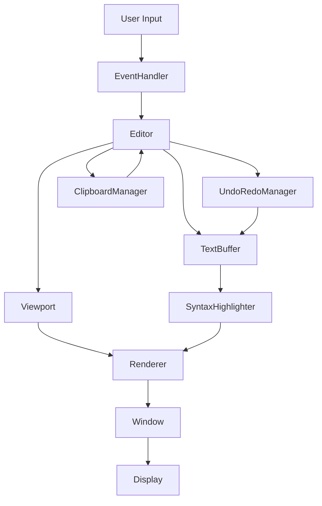

# 🏗️ Arquitectura de CoralCode

Este documento describe la arquitectura modular de CoralCode, diseñada siguiendo las mejores prácticas de C++ para lograr código mantenible, testeable y escalable.

## 📋 Índice

1. [Filosofía de Diseño](#filosofía-de-diseño)
2. [Estructura del Proyecto](#estructura-del-proyecto)
3. [Módulos Principales](#módulos-principales)
4. [Flujo de Datos](#flujo-de-datos)
5. [Patrones de Diseño](#patrones-de-diseño)
6. [Principios SOLID](#principios-solid)
7. [Testing](#testing)
8. [Migración desde Legacy](#migración-desde-legacy)

## 🎯 Filosofía de Diseño

### Principios Fundamentales

1. **🔧 Separación de Responsabilidades** - Cada módulo tiene una responsabilidad específica
2. **🔄 Bajo Acoplamiento** - Los módulos dependen de abstracciones, no implementaciones
3. **🎯 Alta Cohesión** - Los elementos trabajan juntos hacia un objetivo común
4. **🧪 Testabilidad** - Cada componente puede ser probado de forma aislada
5. **🚀 Escalabilidad** - Fácil agregar nuevas funcionalidades

### Ventajas vs Archivo Único

| Aspecto | Archivo Único | Arquitectura Modular |
|---------|---------------|---------------------|
| **Mantenimiento** | ❌ Difícil | ✅ Cambios localizados |
| **Testing** | ❌ Solo integración | ✅ Unit tests por módulo |
| **Colaboración** | ❌ Conflictos frecuentes | ✅ Trabajo paralelo |
| **Reutilización** | ❌ Copy-paste | ✅ Módulos reutilizables |
| **Debugging** | ❌ Difícil localizar | ✅ Aislamiento de errores |
| **Escalabilidad** | ❌ Crecimiento exponencial | ✅ Crecimiento lineal |

## 📁 Estructura del Proyecto

```
CoralCode/
├── include/                    # Headers públicos
│   ├── Editor.hpp             # Clase principal del editor
│   ├── TextBuffer.hpp         # Gestión de contenido
│   ├── Viewport.hpp           # Scroll y visualización
│   ├── SyntaxHighlighter.hpp  # Sistema de highlighting
│   ├── Window.hpp             # Gestión de ventana
│   ├── EventHandler.hpp       # Procesamiento de eventos
│   ├── UndoRedoManager.hpp    # Historial de cambios
│   └── ClipboardManager.hpp   # Operaciones de clipboard
├── src/
│   ├── core/                  # Lógica central del editor
│   │   ├── Editor.cpp
│   │   ├── TextBuffer.cpp
│   │   └── Viewport.cpp
│   ├── ui/                    # Interfaz de usuario
│   │   ├── Window.cpp
│   │   ├── EventHandler.cpp
│   │   └── Renderer.cpp
│   ├── syntax/                # Sistema de syntax highlighting
│   │   ├── SyntaxHighlighter.cpp
│   │   ├── LanguageDetector.cpp
│   │   └── TokenParser.cpp
│   ├── utils/                 # Utilidades y helpers
│   │   ├── ClipboardManager.cpp
│   │   ├── UndoRedoManager.cpp
│   │   ├── FileHandler.cpp
│   │   └── ConfigManager.cpp
│   └── main.cpp               # Punto de entrada
├── tests/                     # Tests unitarios
├── docs/                      # Documentación
├── CMakeLists.txt            # Build system moderno
├── Makefile                  # Build system simple
└── coralcode.cpp             # Versión legacy (mantener compatibilidad)
```

## 🔧 Módulos Principales

### **1. Core (`src/core/`)**

**Responsabilidad:** Lógica fundamental del editor

#### **Editor** (`Editor.hpp/cpp`)
- **Función:** Orquestador principal que coordina todos los subsistemas
- **Responsabilidades:**
  - Inicialización y configuración del editor
  - Coordinación entre módulos
  - Gestión del estado global
  - API pública para operaciones del editor

```cpp
class Editor {
public:
    bool initialize();
    void run();
    void shutdown();
    
    // API pública
    void insertChar(char ch);
    void deleteChar();
    void moveCursor(int deltaLine, int deltaCol);
    void undo();
    void redo();
    
private:
    std::unique_ptr<TextBuffer> textBuffer_;
    std::unique_ptr<Viewport> viewport_;
    // ... otros subsistemas
};
```

#### **TextBuffer** (`TextBuffer.hpp/cpp`)
- **Función:** Gestión eficiente del contenido de texto
- **Responsabilidades:**
  - Almacenar líneas de texto en memoria
  - Operaciones de inserción/eliminación atómicas
  - Validación de posiciones de cursor
  - Operaciones de transformación de texto

#### **Viewport** (`Viewport.hpp/cpp`)
- **Función:** Gestión del viewport y scroll
- **Responsabilidades:**
  - Cálculo de líneas/columnas visibles
  - Lógica de scroll inteligente
  - Auto-scroll basado en cursor
  - Conversión de coordenadas

### **2. UI (`src/ui/`)**

**Responsabilidad:** Interfaz de usuario y renderizado

#### **Window** (`Window.hpp/cpp`)
- **Función:** Gestión de la ventana SFML
- **Responsabilidades:**
  - Creación y configuración de ventana
  - Loop de eventos
  - Gestión de cursores del sistema
  - Configuración de renderizado

#### **EventHandler** (`EventHandler.hpp/cpp`)
- **Función:** Procesamiento inteligente de eventos
- **Responsabilidades:**
  - Traducir eventos SFML a acciones del editor
  - Gestión de shortcuts y combinaciones
  - Filtrado y validación de entrada
  - Configuración por plataforma

#### **Renderer** (`Renderer.hpp/cpp`)
- **Función:** Sistema de renderizado optimizado
- **Responsabilidades:**
  - Renderizado eficiente de texto
  - Aplicación de syntax highlighting
  - Renderizado de UI (líneas, cursor, selección)
  - Optimizaciones de rendimiento

### **3. Syntax (`src/syntax/`)**

**Responsabilidad:** Sistema de syntax highlighting

#### **SyntaxHighlighter** (`SyntaxHighlighter.hpp/cpp`)
- **Función:** Motor principal de highlighting
- **Responsabilidades:**
  - Análisis léxico de texto
  - Aplicación de reglas de lenguaje
  - Gestión de temas de color
  - Cache de resultados

#### **LanguageDetector** (`LanguageDetector.hpp/cpp`)
- **Función:** Detección automática de lenguajes
- **Responsabilidades:**
  - Detección por extensión de archivo
  - Detección por contenido (heurísticas)
  - Gestión de configuraciones de lenguaje

#### **TokenParser** (`TokenParser.hpp/cpp`)
- **Función:** Análisis y clasificación de tokens
- **Responsabilidades:**
  - Parsing de keywords, strings, comentarios
  - Estados de parsing multi-línea
  - Optimización de parsing

### **4. Utils (`src/utils/`)**

**Responsabilidad:** Utilidades y servicios auxiliares

#### **UndoRedoManager** (`UndoRedoManager.hpp/cpp`)
- **Función:** Sistema robusto de historial
- **Responsabilidades:**
  - Gestión eficiente de estados
  - Agrupación inteligente de operaciones
  - Límites de memoria
  - Persistencia opcional

#### **ClipboardManager** (`ClipboardManager.hpp/cpp`)
- **Función:** Integración con clipboard del sistema
- **Responsabilidades:**
  - Operaciones multi-plataforma
  - Conversión de formatos
  - Historial interno
  - Detección de cambios externos

## 🔄 Flujo de Datos

### **Flujo de Entrada (Input):**

1. **SFML Event** → `Window::pollEvents()`
2. **Event Processing** → `EventHandler::handleEvent()`
3. **Action Translation** → `Editor::onKeyPressed()`, `Editor::onTextEntered()`
4. **State Modification** → `TextBuffer::insertChar()`, `UndoRedoManager::saveState()`
5. **Viewport Update** → `Viewport::ensureCursorVisible()`

### **Flujo de Renderizado (Output):**

1. **Viewport Calculation** → `Viewport::getVisibleLines()`
2. **Content Retrieval** → `TextBuffer::getLines()`
3. **Syntax Processing** → `SyntaxHighlighter::highlightLine()`
4. **Rendering** → `Renderer::drawText()`, `Renderer::drawUI()`
5. **Display** → `Window::display()`

### **Flujo de Datos (Diagrama):**



## 🎨 Patrones de Diseño

### **1. MVC (Model-View-Controller)**
- **Model:** `TextBuffer`, `UndoRedoManager`
- **View:** `Renderer`, `Window`
- **Controller:** `Editor`, `EventHandler`

### **2. Strategy Pattern**
- **SyntaxHighlighter:** Diferentes estrategias para cada lenguaje
- **ClipboardManager:** Diferentes implementaciones por plataforma

### **3. Observer Pattern**
- **Editor:** Notifica cambios a subsistemas
- **Viewport:** Observa cambios en cursor y contenido

### **4. Command Pattern**
- **UndoRedoManager:** Cada operación es un comando
- **EventHandler:** Traduce eventos a comandos

### **5. RAII (Resource Acquisition Is Initialization)**
- **Gestión automática de recursos**
- **Smart pointers** para gestión de memoria
- **Destructores automáticos**

## ✅ Principios SOLID

### **S - Single Responsibility Principle**
- Cada clase tiene una responsabilidad específica
- `TextBuffer` solo gestiona contenido
- `Viewport` solo gestiona visualización

### **O - Open/Closed Principle**
- Fácil agregar nuevos lenguajes sin modificar `SyntaxHighlighter`
- Nuevos tipos de eventos sin modificar `EventHandler`

### **L - Liskov Substitution Principle**
- Implementaciones de clipboard intercambiables
- Diferentes renderers compatibles

### **I - Interface Segregation Principle**
- Interfaces específicas para cada funcionalidad
- Clientes no dependen de métodos que no usan

### **D - Dependency Inversion Principle**
- `Editor` depende de abstracciones, no implementaciones
- Inyección de dependencias mediante constructores

## 🧪 Testing

### **Estrategia de Testing:**

```cpp
// Test unitario de TextBuffer
TEST(TextBufferTest, InsertCharacterAtPosition) {
    TextBuffer buffer;
    buffer.insertChar(0, 0, 'H');
    EXPECT_EQ(buffer.getLine(0), "H");
}

// Test de integración
TEST(EditorIntegrationTest, UndoRedoFlow) {
    Editor editor;
    editor.initialize();
    editor.insertChar('A');
    editor.undo();
    EXPECT_EQ(editor.getCurrentLine(), "");
}
```

### **Tipos de Tests:**

1. **Unit Tests:** Cada módulo por separado
2. **Integration Tests:** Interacción entre módulos
3. **Performance Tests:** Benchmarks de rendimiento
4. **UI Tests:** Simulación de eventos de usuario

## 🔄 Migración desde Legacy

### **Estrategia de Migración:**

1. **Fase 1:** Mantener ambas versiones (modular + legacy)
2. **Fase 2:** Extraer funcionalidad módulo por módulo
3. **Fase 3:** Migrar tests y documentación
4. **Fase 4:** Deprecar versión legacy

### **Beneficios Inmediatos:**

- **Desarrollo paralelo** sin interferencias
- **Testing granular** de nuevas funcionalidades
- **Refactoring seguro** con tests de regresión
- **Onboarding más fácil** para nuevos desarrolladores

## 📈 Métricas de Calidad

### **Objetivos:**

- **Cobertura de tests:** >90%
- **Complejidad ciclomática:** <10 por función
- **Acoplamiento:** Bajo (pocas dependencias)
- **Cohesión:** Alta (funciones relacionadas)

### **Herramientas:**

- **Static Analysis:** `clang-tidy`, `cppcheck`
- **Code Coverage:** `gcov`, `lcov`
- **Performance:** `valgrind`, `perf`
- **Documentation:** `doxygen`

---

## 🎯 Conclusión

Esta arquitectura modular transforma CoralCode de un prototipo funcional a un editor profesional y mantenible. Cada módulo tiene responsabilidades claras, es testeable de forma aislada, y puede evolucionar independientemente.

**La inversión en arquitectura se paga con:**
- ✅ **Desarrollo más rápido** a largo plazo
- ✅ **Menos bugs** gracias a mejor testing
- ✅ **Colaboración eficiente** entre desarrolladores
- ✅ **Código reutilizable** para otros proyectos