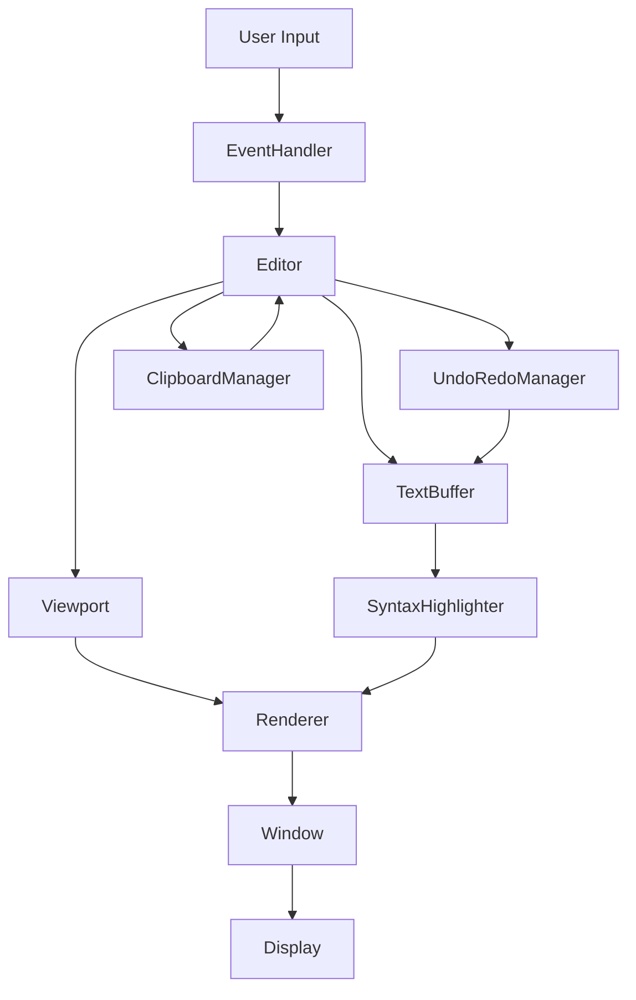

# 🏗️ CoralCode Architecture

This document describes CoralCode's modular architecture, designed following C++ best practices to achieve maintainable, testable, and scalable code.

## 📋 Table of Contents

1. [Design Philosophy](#design-philosophy)
2. [Project Structure](#project-structure)
3. [Core Modules](#core-modules)
4. [Data Flow](#data-flow)
5. [Design Patterns](#design-patterns)
6. [SOLID Principles](#solid-principles)
7. [Testing Strategy](#testing-strategy)
8. [Migration from Legacy](#migration-from-legacy)

## 🎯 Design Philosophy

### Core Principles

1. **🔧 Separation of Concerns** - Each module has a specific, well-defined responsibility
2. **🔄 Low Coupling** - Modules depend on abstractions, not implementations
3. **🎯 High Cohesion** - Elements within each module work together toward a common goal
4. **🧪 Testability** - Each component can be tested in isolation
5. **🚀 Scalability** - Easy to add new features without modifying existing code

### Benefits vs Single File

| Aspect | Single File (Legacy) | Modular Architecture |
|--------|---------------------|---------------------|
| **Maintenance** | ❌ Hard to modify | ✅ Localized changes |
| **Testing** | ❌ Integration tests only | ✅ Unit tests per module |
| **Collaboration** | ❌ Frequent merge conflicts | ✅ Parallel work without conflicts |
| **Reusability** | ❌ Copy-paste code | ✅ Reusable modules |
| **Debugging** | ❌ Hard to locate issues | ✅ Isolated error handling |
| **Scalability** | ❌ Exponential growth | ✅ Linear growth |

## 📁 Project Structure

```
CoralCode/
├── include/                    # Public headers
│   ├── Editor.hpp             # Main editor class
│   ├── TextBuffer.hpp         # Content management
│   ├── Viewport.hpp           # Scroll and visualization
│   ├── SyntaxHighlighter.hpp  # Highlighting system
│   ├── Window.hpp             # Window management
│   ├── EventHandler.hpp       # Event processing
│   ├── UndoRedoManager.hpp    # Change history
│   └── ClipboardManager.hpp   # Clipboard operations
├── src/
│   ├── core/                  # Core editor logic
│   │   ├── Editor.cpp
│   │   ├── TextBuffer.cpp
│   │   └── Viewport.cpp
│   ├── ui/                    # User interface
│   │   ├── Window.cpp
│   │   ├── EventHandler.cpp
│   │   └── Renderer.cpp
│   ├── syntax/                # Syntax highlighting
│   │   ├── SyntaxHighlighter.cpp
│   │   ├── LanguageDetector.cpp
│   │   └── TokenParser.cpp
│   ├── utils/                 # Utilities and helpers
│   │   ├── ClipboardManager.cpp
│   │   ├── UndoRedoManager.cpp
│   │   ├── FileHandler.cpp
│   │   └── ConfigManager.cpp
│   └── main.cpp               # Entry point
├── tests/                     # Unit tests
├── docs/                      # Documentation
├── CMakeLists.txt            # Modern build system
├── Makefile                  # Simple build system
└── coralcode.cpp             # Legacy version (maintain compatibility)
```

## 🔧 Core Modules

### 1. Core (`src/core/`)

**Responsibility:** Fundamental editor logic

#### Editor (`Editor.hpp/cpp`)
- **Function:** Main orchestrator coordinating all subsystems
- **Responsibilities:**
  - Editor initialization and configuration
  - Module coordination
  - Global state management
  - Public API for editor operations

```cpp
class Editor {
public:
    bool initialize();
    void run();
    void shutdown();
    
    // Public API
    void insertChar(char ch);
    void deleteChar();
    void moveCursor(int deltaLine, int deltaCol);
    void undo();
    void redo();
    
private:
    std::unique_ptr<TextBuffer> textBuffer_;
    std::unique_ptr<Viewport> viewport_;
    // ... other subsystems
};
```

#### TextBuffer (`TextBuffer.hpp/cpp`)
- **Function:** Efficient text content management
- **Responsibilities:**
  - Store text lines in memory
  - Atomic insertion/deletion operations
  - Cursor position validation
  - Text transformation operations

#### Viewport (`Viewport.hpp/cpp`)
- **Function:** Viewport and scroll management
- **Responsibilities:**
  - Calculate visible lines/columns
  - Intelligent scroll logic
  - Cursor-based auto-scroll
  - Coordinate conversion

### 2. UI (`src/ui/`)

**Responsibility:** User interface and rendering

#### Window (`Window.hpp/cpp`)
- **Function:** SFML window management
- **Responsibilities:**
  - Window creation and configuration
  - Event loop
  - System cursor management
  - Rendering configuration

#### EventHandler (`EventHandler.hpp/cpp`)
- **Function:** Intelligent event processing
- **Responsibilities:**
  - Translate SFML events to editor actions
  - Shortcut and combination management
  - Input filtering and validation
  - Platform-specific configuration

#### Renderer (`Renderer.hpp/cpp`)
- **Function:** Optimized rendering system
- **Responsibilities:**
  - Efficient text rendering
  - Syntax highlighting application
  - UI rendering (lines, cursor, selection)
  - Performance optimizations

### 3. Syntax (`src/syntax/`)

**Responsibility:** Syntax highlighting system

#### SyntaxHighlighter (`SyntaxHighlighter.hpp/cpp`)
- **Function:** Main highlighting engine
- **Responsibilities:**
  - Text lexical analysis
  - Language rule application
  - Color theme management
  - Result caching

#### LanguageDetector (`LanguageDetector.hpp/cpp`)
- **Function:** Automatic language detection
- **Responsibilities:**
  - Detection by file extension
  - Content-based detection (heuristics)
  - Language configuration management

#### TokenParser (`TokenParser.hpp/cpp`)
- **Function:** Token analysis and classification
- **Responsibilities:**
  - Parse keywords, strings, comments
  - Multi-line parsing states
  - Parsing optimization

### 4. Utils (`src/utils/`)

**Responsibility:** Utilities and auxiliary services

#### UndoRedoManager (`UndoRedoManager.hpp/cpp`)
- **Function:** Robust history system
- **Responsibilities:**
  - Efficient state management
  - Intelligent operation grouping
  - Memory limits
  - Optional persistence

#### ClipboardManager (`ClipboardManager.hpp/cpp`)
- **Function:** System clipboard integration
- **Responsibilities:**
  - Multi-platform operations
  - Format conversion
  - Internal history
  - External change detection

## 🔄 Data Flow

### Input Flow

1. **SFML Event** → `Window::pollEvents()`
2. **Event Processing** → `EventHandler::handleEvent()`
3. **Action Translation** → `Editor::onKeyPressed()`, `Editor::onTextEntered()`
4. **State Modification** → `TextBuffer::insertChar()`, `UndoRedoManager::saveState()`
5. **Viewport Update** → `Viewport::ensureCursorVisible()`

### Rendering Flow

1. **Viewport Calculation** → `Viewport::getVisibleLines()`
2. **Content Retrieval** → `TextBuffer::getLines()`
3. **Syntax Processing** → `SyntaxHighlighter::highlightLine()`
4. **Rendering** → `Renderer::drawText()`, `Renderer::drawUI()`
5. **Display** → `Window::display()`

### Data Flow Diagram



## 🎨 Design Patterns

### 1. MVC (Model-View-Controller)
- **Model:** `TextBuffer`, `UndoRedoManager`
- **View:** `Renderer`, `Window`
- **Controller:** `Editor`, `EventHandler`

### 2. Strategy Pattern
- **SyntaxHighlighter:** Different strategies for each language
- **ClipboardManager:** Different implementations per platform

### 3. Observer Pattern
- **Editor:** Notifies subsystems of changes
- **Viewport:** Observes cursor and content changes

### 4. Command Pattern
- **UndoRedoManager:** Each operation is a command
- **EventHandler:** Translates events to commands

### 5. RAII (Resource Acquisition Is Initialization)
- **Automatic resource management**
- **Smart pointers** for memory management
- **Automatic destructors**

## ✅ SOLID Principles

### S - Single Responsibility Principle
- Each class has a specific responsibility
- `TextBuffer` only manages content
- `Viewport` only manages visualization

### O - Open/Closed Principle
- Easy to add new languages without modifying `SyntaxHighlighter`
- New event types without modifying `EventHandler`

### L - Liskov Substitution Principle
- Interchangeable clipboard implementations
- Compatible multiple renderers

### I - Interface Segregation Principle
- Specific interfaces for each functionality
- Clients don't depend on unused methods

### D - Dependency Inversion Principle
- `Editor` depends on abstractions, not implementations
- Dependency injection through constructors

## 🧪 Testing Strategy

### Testing Approach

```cpp
// Unit test
TEST(TextBufferTest, InsertCharacterAtPosition) {
    TextBuffer buffer;
    buffer.insertChar(0, 0, 'H');
    EXPECT_EQ(buffer.getLine(0), "H");
}

// Integration test
TEST(EditorIntegrationTest, UndoRedoFlow) {
    Editor editor;
    editor.initialize();
    editor.insertChar('A');
    editor.undo();
    EXPECT_EQ(editor.getCurrentLine(), "");
}
```

### Test Types

1. **Unit Tests:** Each module separately
2. **Integration Tests:** Module interaction
3. **Performance Tests:** Performance benchmarks
4. **UI Tests:** User event simulation

## 🔄 Migration from Legacy

### Migration Strategy

1. **Phase 1:** Maintain both versions (modular + legacy)
2. **Phase 2:** Extract functionality module by module
3. **Phase 3:** Migrate tests and documentation
4. **Phase 4:** Deprecate legacy version

### Immediate Benefits

- **Parallel development** without interference
- **Granular testing** of new features
- **Safe refactoring** with regression tests
- **Easier onboarding** for new developers

## 📈 Quality Metrics

### Goals

- **Test coverage:** >90%
- **Cyclomatic complexity:** <10 per function
- **Coupling:** Low (few dependencies)
- **Cohesion:** High (related functions)

### Tools

- **Static Analysis:** `clang-tidy`, `cppcheck`
- **Code Coverage:** `gcov`, `lcov`
- **Performance:** `valgrind`, `perf`
- **Documentation:** `doxygen`

---

## 🎯 Conclusion

This modular architecture transforms CoralCode from a functional prototype to a professional, maintainable editor. Each module has clear responsibilities, is testable in isolation, and can evolve independently.

**The investment in architecture pays off with:**
- ✅ **Faster development** in the long run
- ✅ **Fewer bugs** thanks to better testing
- ✅ **Efficient collaboration** between developers
- ✅ **Reusable code** for other projects 